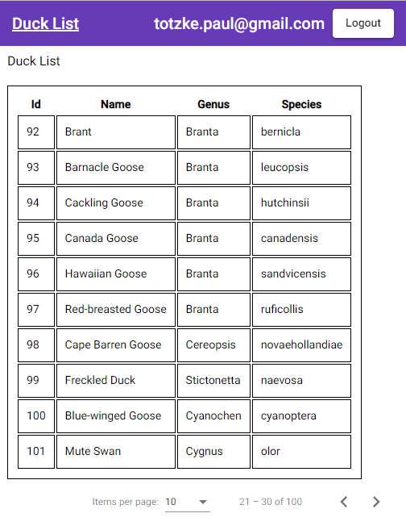

# DuckApi

Try out the Duck UI:
https://totzkepaul.github.io/duck-ui/#

#Time Breakdown:

Adding Jwt to Angular: 2 hours
Adding Pagination to Angular: 1 hour
Setting up Azure AD to work with Postman: 4 hours (I set up the wrong claims provider - should have been 1 hour)
Look up ducks dataset and create csv upload: 1 hour
Add Pagination and sorting to Api: 1 hour
Add CICD Pipelines for Deployment: 1 hour
Create Database from ORM with unique Name and Genus+Species constrants: 1 hour
Add CRUD Operations to API: 2 hours
Setup Azure Sql Server Database: 1 hour
Testing: 1 hour

